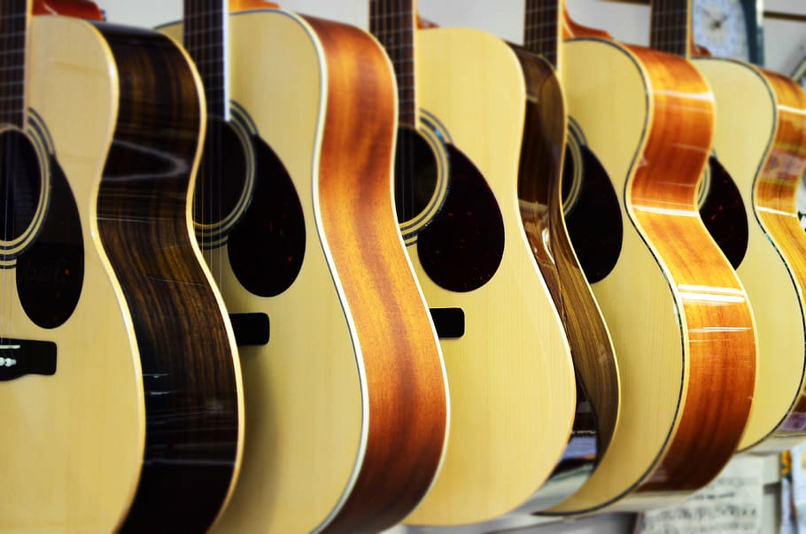

# Acoustic guitar classifier

This repo contains all code and files necessary for building an image classification model and deploying it as a simple web app with the brand new [fastai v2](http://dev.fast.ai/) libary. You can check out the web app [here](https://mybinder.org/v2/gh/stefan-jo/guitar_classifier/master?urlpath=%2Fvoila%2Frender%2Fguitar_classifier_webapp.ipynb)!

Short description of all files:
- export.pkl : trained image classifier
- guitar_classifier_model.ipynb : notebook for data preparation and fine-tuning a pre-trained ResNet18
- guitar_classifier_webapp.ipynb : notebook for deploying the model with [ipywidgets](https://ipywidgets.readthedocs.io/en/latest/#), [Voila](https://voila.readthedocs.io/en/stable/index.html) and [Binder](https://mybinder.org/)
- image_cleaner.JPG : image used in guitar_classifier_model.ipynb
- readme_img.jpg : image used in README.md
- requirements.txt : file specifying all required libraries
- utils.py : utils file from fastai v2 defining settings and helper functions

If you have any questions, feel free to reach out to me : s.josef.consulting@gmail.com
